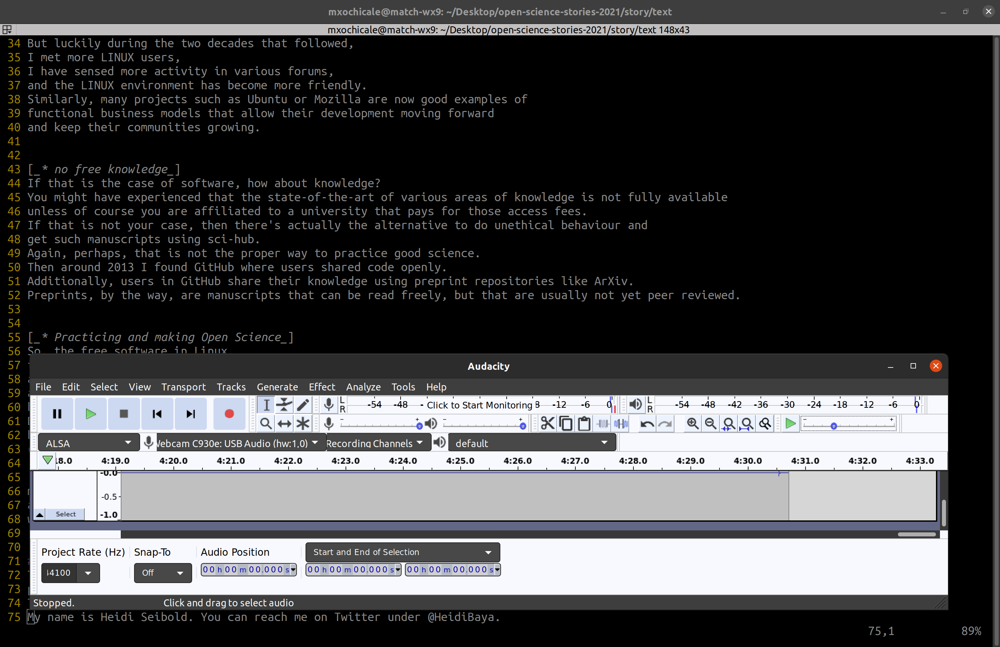

# Recordings of audio with Audacity
* Audio recorded with Audacity 2.3.3 in Ubuntu 20.04X64
* The format of the audio is `*.ogg`

## Instructions for recording audio file
1. Open Audacity 
2. Press record button and test one or two seconds then delete it!
3. Prepare text a helper for the recording and Press the button with red circle to start recording and then the black square to stop.
4. You might record it various times as the script will be polishes! 
5. Export audio with ogg extension using quality 0 or other from 0 to 10.
6. Test it by play it using VLC. 

## Trials
* trial05 and final
tryied four times recordings 

* trial04 
Recorded with audio quality 5 and exported with ogg format
* trial03 
Recorded with audio quality 0 and exported with ogg format
